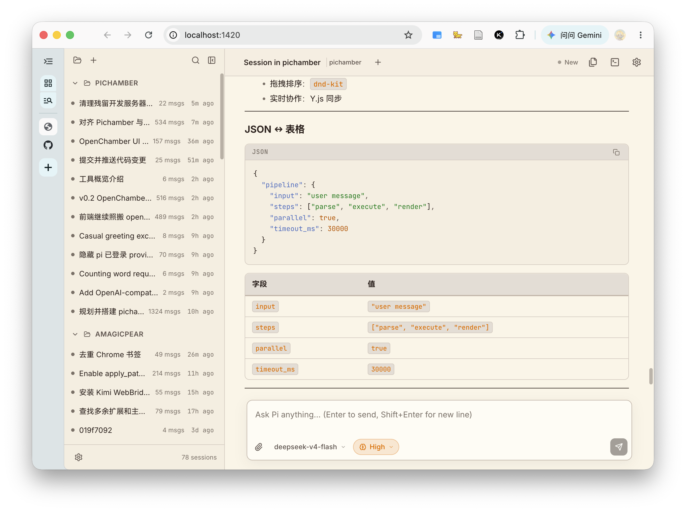

# Pichamber



Pichamber is a browser-based interface for the [Pi Coding Agent](https://github.com/badlogic/pi-mono). It combines Pi's extension-first RPC runtime with a project, session, chat, tool, file, and terminal workflow inspired by OpenChamber — all running in a browser tab, served by a single local Rust binary.

Version 0.2 makes Pichamber a browser-first application. No Electron, no Tauri: just `pichamber serve` and open `localhost:1420`.

## Product direction

- Browser-first: a local HTTP+WebSocket server with a React frontend, matching OpenChamber's architecture.
- Pi-native: `pi --mode rpc` and Pi JSONL sessions remain the runtime and source of truth.
- Familiar workflow: interaction density and workspace layout mirror OpenChamber without copying its source.
- Thin host: product-specific agent behavior belongs in Pi packages and extensions, not in Pichamber.
- Workspace-scoped trust: filesystem and command access constrained to explicitly opened directories.

## Features

- Sidebar that directly browses Pi's session store (`~/.pi/agent/sessions/`), grouped by working directory.
- Real Pi `--mode rpc` streaming with per-session process isolation.
- Assistant text, thinking, tool execution, errors, and extension UI requests.
- Model and thinking-level selection, stop, fork, file references, and session history.
- Workspace-scoped file tree and file viewer.
- Interactive PTY terminal powered by `portable-pty` and xterm.js.
- Command palette, light/dark/system themes, and keyboard navigation.
- Workspace path sandboxing, Pi session path validation, and generation-safe runtime events.

## Architecture

```
Browser ──fetch/WS──> Rust HTTP server (axum) ──stdin/stdout──> Pi RPC processes
                          │
                          ├── PTY management (portable-pty)
                          ├── File system (workspace-scoped)
                          └── Session listing (Pi JSONL store)
```

- **Frontend**: React 19 + TypeScript + Vite 7, Zustand stores, OKLCH design tokens
- **Backend**: Rust (axum) HTTP + WebSocket server, embedded frontend dist
- **No desktop framework**: no Electron, no Tauri — just a browser tab

See [PLAN.md](PLAN.md) for scope, architecture, milestones, and acceptance criteria.

## Development

Prerequisites: Node.js 22+, Bun 1.3+, Rust, and an installed Pi CLI.

```bash
bun install
bun run dev           # Vite dev server (browser-only, demo runtime)
cargo run -- serve    # Full stack (starts server + Pi processes)
```

## Verification

```bash
bun run check
bun run test
bun run build:frontend
cargo check
cargo test
```

The production binary is built with `cargo build --release` and embeds the frontend dist.

## Reference projects

- [openchamber](https://github.com/AMagicPear/openchamber): product interaction, responsive layout, visual hierarchy, architecture, and transport layer reference.
- [pi-desktop](https://github.com/badlogic/pi-desktop): Pi RPC, session, process lifecycle, extension UI, and native host reference.
